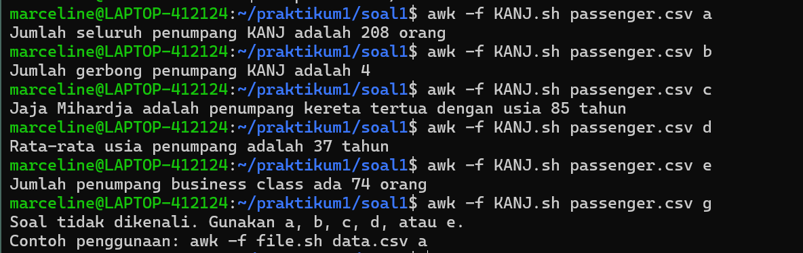
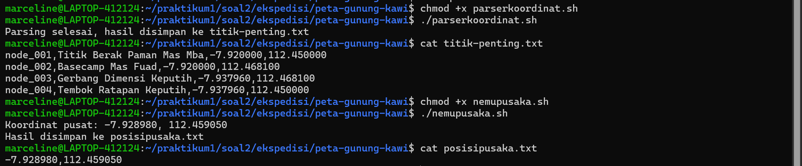

# SISOP-1-2026-IT-044

## SOAL 1
### Deskripsi Soal
Membuat `awk` yang dapat menganalisis data `passenger.csv` yaitu:
* `a`: Jumlah seluruh penumpang
* `b`: Jumlah gerbong penumpang
* `c`: Data penumpang tertua
* `d`: Rata-rata usia penumpang
* `e`: Jumlah penumpang _business class_ 

### Pengerjaan
**1. BEGIN**
```awk
BEGIN {
    FS = ","
    mode = ARGV[2]
    delete ARGV[2]
}
```
- `FS = ","` → set pemisah kolom menjadi koma karena file CSV
- `ARGV[2]` → mengambil argumen ketiga dari command line (a/b/c/d/e)
- `delete ARGV[2]` → menghapus argumen tersebut dari ARGV agar tidak terbaca sebagai nama file

**2. Membaca Data**
```awk
NR == 1 { next }
{
    nama    = $1
    usia    = $2
    kelas   = $3
    gerbong = $4
}
```
- `NR == 1 { next }` → skip baris pertama (header)
- `$1, $2, $3, $4` → kolom-kolom CSV sesuai urutannya

**3. Sub soal**
* (a) Total Penumpang
  ```awk
  count_passenger++
  ```
	Counter yang bertambah 1 setiap baris data dibaca.

* (b) Jumlah gerbong
	```awk
	gerbong_list[gerbong] = 1
	```
	Menggunakan array asosiatif dengan key = nama gerbong. Jika gerbong  yang sama muncul lagi, nilainya tetap 1 sehingga tidak terhitung dobel. Di END, jumlah key dihitung dengan `for (g in gerbong_list) carriage++`.
* (c) Penumpang tertua
  ```awk
	if (NR == 2 || usia > max_usia) {
	    max_usia = usia
  	  oldest = nama
	}
	```
	- `NR == 2` → inisialisasi di baris data pertama
	- Setiap menemukan usia lebih besar, `max_usia` dan `oldest` diupdate
* (d) Rata-rata usia
  ```awk
	total_usia += usia

	di END:
	average_age = int(total_usia / count_passenger)
	```
	- Menjumlahkan seluruh usia setiap baris dibaca
	- `int()` untuk membulatkan hasil tanpa angka di belakang koma
* (e) Business class
  ```awk
	if (kelas == "Business") {
  	  business_passenger++
	}
	```
	Memfilter baris yang kolom ketiga (`$3`) bernilai "Business".

**4. Opsi Tidak Valid**

Jika user memasukkan opsi selain a/b/c/d/e, program menampilkan pesan error beserta contoh penggunaan yang benar.
```awk
} else {
    print "Soal tidak dikenali. Gunakan a, b, c, d, atau e."
    print "Contoh penggunaan: awk -f file.sh data.csv a"
}
```

### Output


## SOAL 2
### Deskripsi Soal
Membantu Mas Amba menemukan koordinat pusaka tersembunyi di Gunung Kawi menggunakan shell script dan parsing JSON.

### Pengerjaan
**1. Install `gdown` dan download PDF**
```bash
python3 -m venv myenv
source myenv/bin/activate
pip install gdown
mkdir -p ekspedisi
gdown "https://drive.google.com/uc?id=..." -O ekspedisi/peta-ekspedisi-amba.pdf
```
- `python3 -m venv myenv` → membuat virtual environment Python
- `source myenv/bin/activate` → mengaktifkan virtual environment
- `pip install gdown` → menginstall tool download Google Drive
- `gdown` → mendownload file dari Google Drive ke folder `ekspedisi/`

**2. Membaca isi PDF**
```bash
cat ekspedisi/peta-ekspedisi-amba.pdf
```
Perintah `cat` (concatenate) digunakan untuk membedah isi file PDF 
dan mencari tautan tersembunyi di dalamnya.

**3. Clone repository**
```bash
git clone  ekspedisi/peta-gunung-kawi
```
- `git clone` → mengunduh seluruh isi repository dari URL yang ditemukan
- Hasilnya tersimpan di folder `ekspedisi/peta-gunung-kawi/`

**4. `parsekoordinat.sh`**
```bash
ids=$(grep -o '"id": *"node_[0-9]*"' "$INPUT" | sed 's/"id": *"\(.*\)"/\1/')
site_names=$(grep -o '"site_name": *"[^"]*"' "$INPUT" | sed 's/"site_name": *"\(.*\)"/\1/')
latitudes=$(grep -o '"latitude": *-\?[0-9.]*' "$INPUT" | sed 's/"latitude": *\(.*\)/\1/')
longitudes=$(grep -o '"longitude": *-\?[0-9.]*' "$INPUT" | sed 's/"longitude": *\(.*\)/\1/')
```
- `grep -o` → mengekstrak teks yang cocok dengan pattern saja
- `sed 's/.../.../'` → memformat hasil grep, mengambil nilai di dalam tanda kutip
- `-\?[0-9.]*` → regex untuk angka desimal yang bisa negatif (koordinat selatan)
- Keempat variabel kemudian digabungkan per baris dan disimpan ke `titik-penting.txt`

**5. `nemupusaka.sh`**
```bash
lat1=$(awk -F',' 'NR==1 {print $3}' "$INPUT")
lon1=$(awk -F',' 'NR==1 {print $4}' "$INPUT")
lat2=$(awk -F',' 'NR==3 {print $3}' "$INPUT")
lon2=$(awk -F',' 'NR==3 {print $4}' "$INPUT")

lat_pusat=$(awk "BEGIN {printf \"%.6f\", ($lat1 + $lat2) / 2}")
lon_pusat=$(awk "BEGIN {printf \"%.6f\", ($lon1 + $lon2) / 2}")
```
- `awk -F','` → membaca `titik-penting.txt` dengan pemisah koma
- `NR==1` dan `NR==3` → mengambil koordinat node_001 dan node_003 (diagonal)
- Titik pusat dihitung dengan rumus titik simetri diagonal:
  - `lat_pusat = (lat1 + lat2) / 2`
  - `lon_pusat = (lon1 + lon2) / 2`
- `printf "%.6f"` → format hasil dengan 6 angka desimal

### Output

